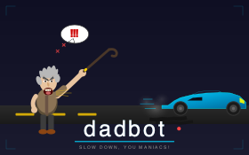

<p align="center">
  
</p>

<h1 align="center">DadBot Traffic Monitor</h1>

<p align="center">
  <strong>AI-powered residential traffic monitoring system for side-view camera setups</strong>
</p>

<p align="center">
  <a href="#features">Features</a> •
  <a href="#installation">Installation</a> •
  <a href="#quick-start">Quick Start</a> •
  <a href="#usage">Usage</a> •
  <a href="#configuration">Configuration</a> •
  <a href="#contributing">Contributing</a>
</p>

---

DadBot is a traffic monitoring system designed for residential streets using side-view cameras. It detects vehicles, estimates speeds through calibration, tracks movement across frames, and generates compliance reports with metrics like vehicle counts, speeds, direction of travel, and violations.

Built on [Roboflow's](https://roboflow.com) computer vision ecosystem, DadBot uses state-of-the-art RF-DETR object detection and ByteTrack multi-object tracking via the [Supervision](https://github.com/roboflow/supervision) library.

## Demo

<p align="center">
  
</p>

## Features

- **Real-time Vehicle Detection** - RF-DETR and YOLO model support with cloud or local inference
- **Speed Estimation** - Calibration-based speed calculation for side-view camera geometry
- **Direction Tracking** - Automatic eastbound/westbound classification
- **Road Zone Filtering** - Polygon-based filtering to exclude parked vehicles
- **Speed Violation Detection** - Configurable speed limits with per-vehicle reporting
- **Lens Distortion Correction** - Mathematical correction for accurate measurements
- **Aggregated Reporting** - Time-windowed JSON Lines reports for compliance
- **GUI Application** - Full-featured Tkinter interface for configuration and monitoring
- **Live Streaming** - Support for webcams, RTSP streams, and video files

## Requirements

- Python 3.12+
- [uv](https://github.com/astral-sh/uv) package manager
- [Roboflow API Key](https://app.roboflow.com/settings/api) (free tier available)

## Installation

### 1. Clone the repository

```bash
git clone https://github.com/yourusername/dadbot.git
cd dadbot
```

### 2. Install dependencies

```bash
make install
```

Or manually with uv:

```bash
uv sync
```

### 3. Configure environment

Copy the example environment file and add your Roboflow API key:

```bash
cp .env.example .env
```

Edit `.env`:

```env
ROBOFLOW_API_KEY=your_api_key_here
```

### 4. Set up configuration (optional)

Copy the example settings file:

```bash
cp config/settings.example.yaml config/settings.yaml
```

## Quick Start

### Process a video file

```bash
make run-video VIDEO=path/to/your/video.mp4
```

Or using the CLI directly:

```bash
uv run python -m src.main --source-video path/to/your/video.mp4
```

### Launch the GUI

```bash
make gui
```

Or:

```bash
uv run python run_gui.py
```

### Use a webcam

```bash
uv run python -m src.main --source-video 0
```

## Usage

### Command Line Interface

```bash
uv run python -m src.main --source-video <path> [options]
```

**Options:**

| Option | Default | Description |
|--------|---------|-------------|
| `--source-video` | (required) | Path to video file or camera index (0 for webcam) |
| `--model-id` | `rfdetr-base` | Detection model (`rfdetr-nano`, `rfdetr-base`, `rfdetr-large`, `yolov8n-640`) |
| `--confidence` | `0.3` | Detection confidence threshold (0.0-1.0) |
| `--reference-distance` | `20.16` | Calibration reference distance in feet |
| `--speed-limit` | `25.0` | Speed limit for violations (MPH) |
| `--aggregation-window` | `300` | Report aggregation window in seconds |
| `--no-preview` | - | Disable live preview window |
| `--no-save-video` | - | Disable annotated video output |
| `--zone` / `--no-zone` | - | Enable/disable road zone filtering |

**Example:**

```bash
uv run python -m src.main \
  --source-video ./reference/clipped_1.mp4 \
  --model-id rfdetr-base \
  --confidence 0.4 \
  --speed-limit 25 \
  --zone
```

### GUI Application

The GUI provides five main panels:

1. **Live Viewer** - Real-time detection on camera/RTSP streams
2. **Processor** - Batch video file processing with progress tracking
3. **Calibration** - Interactive speed calibration tool
4. **Zone Definition** - Draw road zone polygons
5. **Lens Calibration** - Correct lens distortion

### Output Files

- **Annotated Video**: `output/annotated_output.mp4`
- **Traffic Report**: `output/{timestamp}_traffic_report.jsonl`
- **Logs**: `logs/{timestamp}/dadbot.log`

### Report Format

Reports are generated in JSON Lines format with aggregated metrics per time window:

```json
{
  "window_start": "2024-01-15T10:00:00",
  "window_end": "2024-01-15T10:05:00",
  "total_vehicles": 42,
  "vehicles_by_direction": {"eastbound": 25, "westbound": 17},
  "vehicles_by_type": {"car": 38, "truck": 3, "motorcycle": 1},
  "top_speed_mph": 38.5,
  "average_speed_mph": 27.3,
  "speed_violations": [
    {"vehicle_id": 15, "speed": 38.5, "timestamp": "...", "class": "car", "direction": "eastbound"}
  ],
  "commercial_trucks": 2
}
```

## Configuration

### Environment Variables

| Variable | Description |
|----------|-------------|
| `ROBOFLOW_API_KEY` | Your Roboflow API key (required) |
| `DADBOT_CALIBRATION_REFERENCE_DISTANCE_FEET` | Known reference distance |
| `DADBOT_DETECTION_MODEL_ID` | Detection model to use |
| `DADBOT_DETECTION_CONFIDENCE_THRESHOLD` | Confidence threshold |
| `DADBOT_TRACKING_SPEED_LIMIT_MPH` | Speed limit for violations |
| `DADBOT_REPORTING_AGGREGATION_WINDOW_SECONDS` | Report window size |

### Settings File

The `config/settings.yaml` file provides comprehensive configuration:

```yaml
# Road Zone Filtering
zone:
  enabled: true
  polygon_points:
    - [3, 287]
    - [1078, 412]
    - [1081, 554]
    - [4, 411]

# Speed Calibration
calibration:
  reference_distance_feet: 20.16
  reference_pixel_start_x: 0
  reference_pixel_end_x: 269

# Detection
detection:
  model_id: "rfdetr-base"
  confidence_threshold: 0.3

# Tracking
tracking:
  speed_limit_mph: 25.0
  min_frames_for_speed: 10

# Visualization
visualization:
  show_traces: true
  highlight_violations: true
```

See [config/settings.example.yaml](config/settings.example.yaml) for all available options.

### Calibration

For accurate speed measurements, calibrate using a known reference:

1. **GUI Method**: Use the Calibration panel to click two points on a known object
2. **Manual Method**: Measure an object of known length (e.g., vehicle, road marking) and note its pixel width

The default calibration assumes a 20.16 ft reference spanning 269 pixels.

## Development

### Setup development environment

```bash
make dev
```

### Run tests

```bash
make test
```

### Lint and format

```bash
make lint
make format
```

### Available Make targets

```bash
make help       # Show all available targets
make install    # Install dependencies
make dev        # Install with dev dependencies
make test       # Run pytest
make lint       # Run ruff check
make format     # Run ruff format
make run        # Execute main pipeline
make gui        # Launch GUI application
make clean      # Remove all artifacts
```

## Architecture

```
Video Input → Detection (RF-DETR) → Tracking (ByteTrack) → Speed Estimation → Reporting
                    ↓                      ↓                      ↓
              Zone Filtering        Direction Detection      Visualization
```

**Key Components:**

- `src/detector.py` - Vehicle detection with Roboflow models
- `src/tracker.py` - ByteTrack tracking and speed estimation
- `src/reporter.py` - JSON Lines report generation
- `src/visualizer.py` - Frame annotation with Supervision
- `src/config.py` - Pydantic configuration models
- `src/gui/` - Tkinter GUI application

## Tech Stack

- **Detection**: [RF-DETR](https://blog.roboflow.com/rf-detr/) / YOLOv8 via Roboflow
- **Tracking**: [ByteTrack](https://github.com/ifzhang/ByteTrack) via Supervision
- **Computer Vision**: OpenCV, NumPy
- **Configuration**: Pydantic, PyYAML
- **GUI**: Tkinter
- **Package Management**: [uv](https://github.com/astral-sh/uv)

## Troubleshooting

### "ROBOFLOW_API_KEY not set"

Ensure your `.env` file exists and contains a valid API key:

```bash
cp .env.example .env
# Edit .env and add your key
```

### Slow detection performance

- Use cloud inference (default) for GPU acceleration
- Try a lighter model: `--model-id rfdetr-nano`
- Reduce input resolution in settings

### Inaccurate speed readings

- Verify calibration using a known reference object
- Check lens distortion settings for wide-angle cameras
- Ensure the road zone polygon is correctly defined

## Contributing

Contributions are welcome! Please feel free to submit a Pull Request.

1. Fork the repository
2. Create your feature branch (`git checkout -b feature/amazing-feature`)
3. Commit your changes (`git commit -m 'Add amazing feature'`)
4. Push to the branch (`git push origin feature/amazing-feature`)
5. Open a Pull Request

## License

This project is provided as-is. See the repository for licensing details.

## Acknowledgments

- [Roboflow](https://roboflow.com) for the inference platform and RF-DETR models
- [Supervision](https://github.com/roboflow/supervision) library for computer vision utilities
- [ByteTrack](https://github.com/ifzhang/ByteTrack) for multi-object tracking
